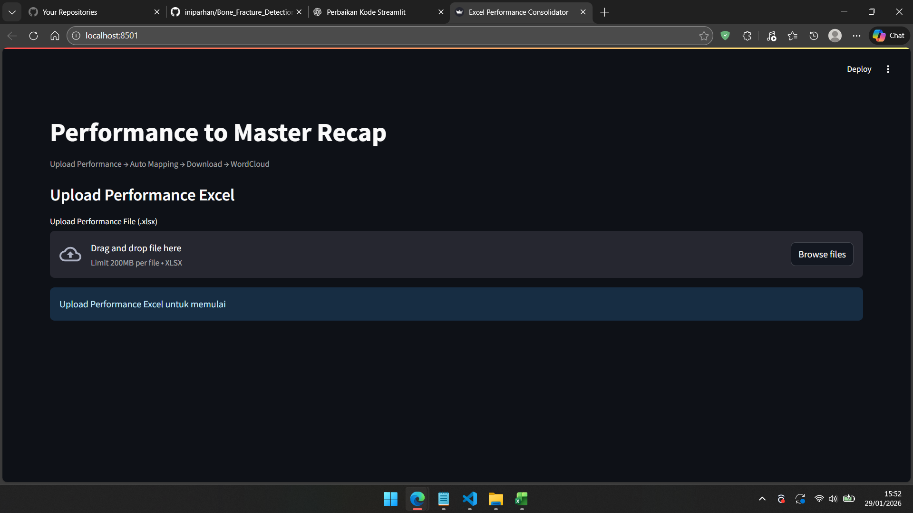
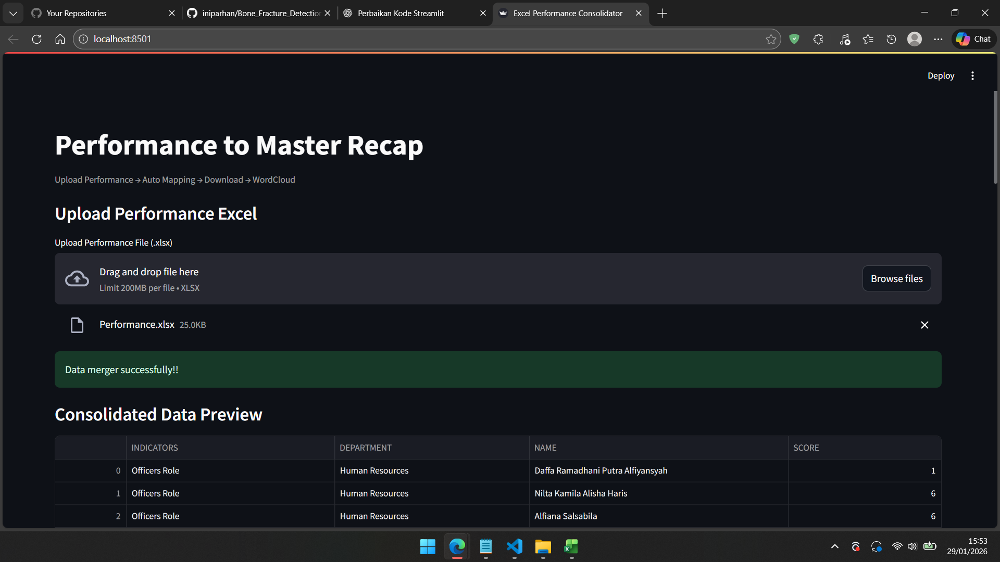
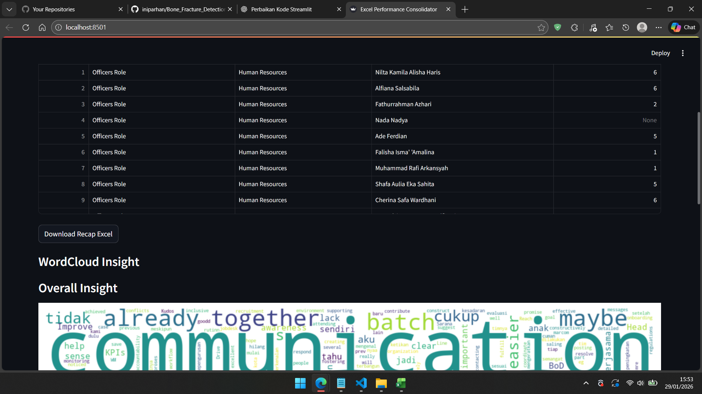
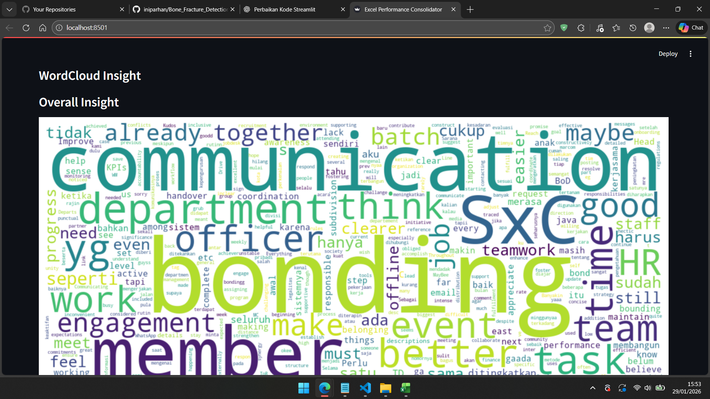
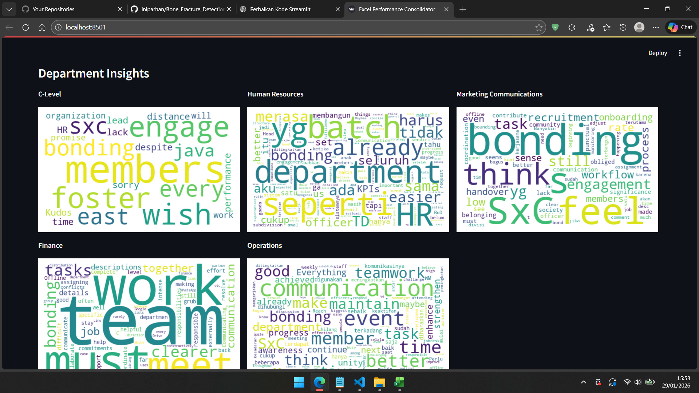

# Excel Data Merger

The Excel Data Merger is a Streamlit-based web application designed to merge, recap, and analyze Excel files generated from evaluation or assessment forms. This application helps the Talent Analytics (TC) team at StudentxCEO streamline their workflow and process data more efficiently. It also provides wordcloud visualizations grouped by department.

## Application Access

You can access the application via the following link:

https://excel-data-merger-tece.streamlit.app/


## How to Use the Application

### 1. Upload Excel File

On the main page, upload the evaluation form results in **Excel (.xlsx)** format.




### 2. File Successfully Processed

Once the file is successfully uploaded and processed, the application interface will appear as shown below:




### 3. Download Recap Data

To download the processed and merged data, click the **Download Recap Excel** button.




### 4. Wordcloud Visualization

The application provides **wordcloud visualizations** representing the aggregated data across all departments.





## Running the Application Locally

Follow the steps below to run the application on your local machine.

### 1. Install Dependencies

Install all required libraries using the following command:

```bash
pip install streamlit pandas matplotlib wordcloud openpyxl
```

Alternatively, you can install them using the `requirements.txt` file:

```bash
pip install -r requirements.txt
```


### 2. Run the Application

Execute the application via terminal using the command below:

```bash
python -m streamlit run app.py
```

After running the command, the application will automatically open in your default web browser.
